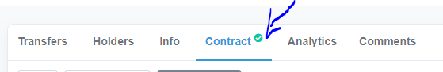
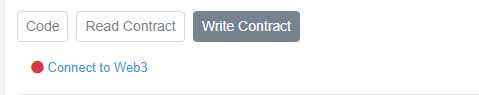
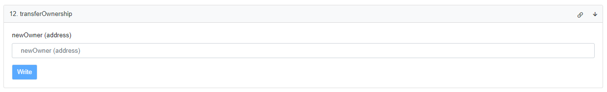

Transfert Owner
=========

Il est conseillé de changer de owner régulierement , afin d'eviter les Hacks . La methode la plus simple consiste a interagir avec le contrat par le biais de BSCscan .
La methode est la meme pour toutes les blockchains EVM et tous types de smart contracts .
Pour cela vous devez etre le owner du contrat .

Connectez vous a l'adresse du contrat 

https://bscscan.com/token/0x1E16D4579D6a1471745a20eC491739e201971151#writeContract

   
   
Cliquez sur "write contract" puis sur "connect to web3"
   

   
   
Quand vous etes connectés cliquez sur "transfer ownership"   
   

Etrez la nouvelle adresse owner puis validez
